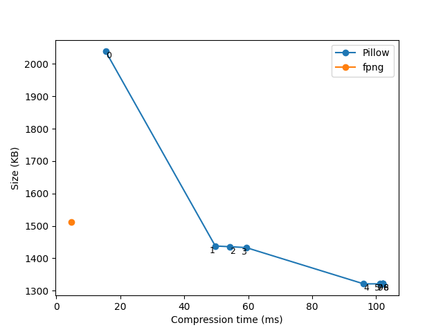
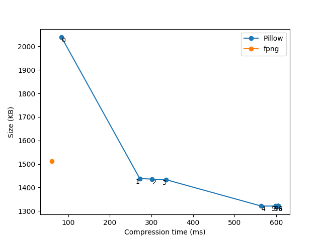
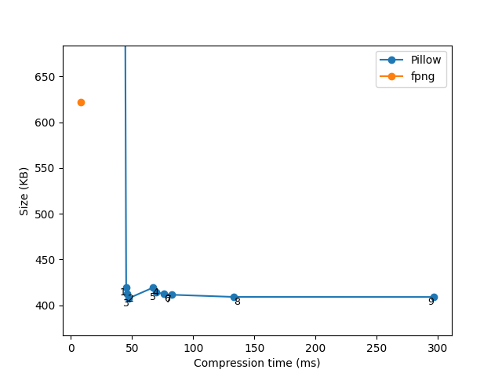
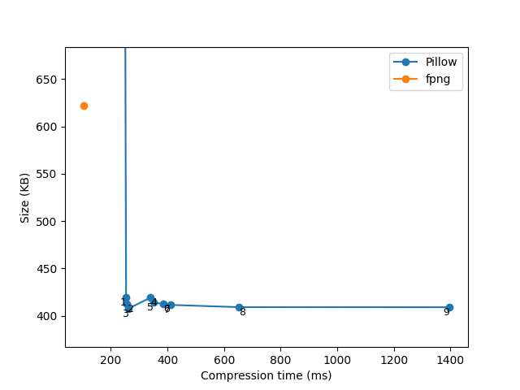

# py-fpng-nb

Very fast .PNG image writer for Python.

py-fpng-nb is a Python wrapper of [fpng](https://github.com/richgel999/fpng)


## Installation

```sh
pip install fpng
```

If installation fails, upgrade pip with `python -m pip install --upgrade pip` and try again.


## Usage

### with PIL

```python
import fpng
from PIL import Image

# ...

img.save('file_path.png', 'FPNG')
```

### with NDarray

n-dimensional arrays of NumPy, PyTorch, TensorFlow, JAX, and CuPy.

Must have 3 dimensions [height, width, channels] with RGB or RGBA format.

```python
import fpng

# ...

png_bytes = fpng.from_ndarray(img_ndarray)

with open('file_path.png', 'wb') as f:
    f.write(png_bytes)
```


### with OpenCV

```python
import cv2
import fpng

# ...

png_bytes = fpng.from_cv2(img_mat)

with open('file_path.png', 'wb') as f:
    f.write(png_bytes)
```


## Benchmark

Comparison with Pillow 11.0.0

### Photo image

 | 
:---: | :---:
x86_64 | AArch64(ARM64)

### Screenshot image

[Screenshot](tests/wikipedia.png) of Wikipedia

 | 
:---: | :---:
x86_64 | AArch64(ARM64)
